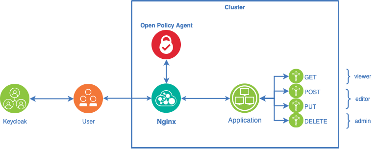

# RBAC on Nginx with Open Policy Agent and JWT-token

This repository demonstrates how to implement role based access control (RBAC) on
[Nginx](https://nginx.org/) with
[Open Policy Agent](https://www.openpolicyagent.org/)
and JWT-token (Keycloak).



## How to use

First, start the container of Nginx and Open Policy Agent.

```sh
docker-compose up -d
```

First send request to `/jwt/create` route to create a token.
Token will be created similar to Keycloak token.

- `/jwt/create` will generate jwt token without roles
- `/jwt/create/viewer` will generate jwt token with role `viewer`
- `/jwt/create/editor` will generate jwt token with role `editor`
- `/jwt/create/admin` will generate jwt token with role `admin`
  
Then send a request to `/security/` with token in header `Authorization`
nginx will grant access based on role definition.

## Defining roles and role bindings

Authorization by RBAC is implemented by the combination
of Nginx and Open Policy Agent.

You must generate token with roles.
The role has a combination of a path and an list of HTTP methods allowing access,
and the Open Policy Agent performs authorization based on the role.

```json
{
  "roles": {
    "viewer": {
      "/security/*": ["GET"]
    },
    "editor": {
      "/security/*": ["GET", "POST", "PUT"]
    },
    "admin": {
      "/security/*": ["GET", "POST", "PUT", "DELETE"]
    }
  }
}
```

## Useful links

Nginx + OPA with certficiates - <https://github.com/summerwind/opa-nginx-rbac>  
Nginx Plus + OPA - <https://github.com/lcrilly/nginx-plus-opa>
