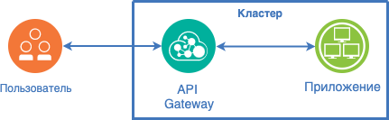

# Авторизация для бедных или как сделать RBAC для REST API с помощью OPA

- [Авторизация для бедных или как сделать RBAC для REST API с помощью OPA](#авторизация-для-бедных-или-как-сделать-rbac-для-rest-api-с-помощью-opa)
  - [Для чего это вообще нужно?](#для-чего-это-вообще-нужно)
  - [Приложение](#приложение)
  - [Gateway, авторизация и приложение](#gateway-авторизация-и-приложение)
  - [Реализация](#реализация)
    - [Nginx](#nginx)
    - [JWT](#jwt)
    - [API](#api)
    - [OPA](#opa)
      - [Nginx + OPA](#nginx--opa)
    - [Использование](#использование)
  - [А теперь время неудобных вопросов](#а-теперь-время-неудобных-вопросов)
  - [Полезные ссылки](#полезные-ссылки)

Когда речь заходит про права доступа в приложении,
то из этой ситуации появляется два результата:

- Либо в коде приложения появляются привязки к неким ролям/scope’ам;
- Либо разработчик обрастает бородой и начинает сыпать фразами вроде abaс,
  xacml и матрица доступа.

Если вам интересно как можно из подручных средств собрать RBAC
на любой сервис соблюдающий REST, то добро пожаловать.

## Для чего это вообще нужно?

- **POC**: При быстрой реализации Proof of Concept приложений или функций,
  очень часто реализация безопасности уходит на второй план.
  А иногда от этих функций требуется хотя бы реализация авторизации,
  как демонстрация возможности ограничений для пользователей;

- **Ресурсы**: При развертывании в условиях ограниченных ресурсов
  велико желание пренебречь самым тяжеловесными функциями,
  в том числе вычисления прав доступа.
  Хочется иметь решение, которым удастся закрыть ключевые функции
  без трудоемких интеграций с системами безопасности;

- **Firewall**: При использовании такой функции в качестве фаервола
  на входе в кластер можно отчасти гарантировать дополнительный слой безопасности.
  Например, в кластер могут попасть приложения, которые не реализуют
  функций безопасности.
  Таким образом в конфигурацию можно заложить два блока: доверенные приложения,
  которые гарантируют безопасность и все остальные, которые закрываются данным блоком.
  Пусть и с серьезными оговорками.

Если коротко, то всю эту статью можно уместить в следующую фразу:
При обработке запроса в Nginx, перед отправлением его в сервис,
отправляем запрос доступа в OPA, получаем результат авторизации,
если доступ разрешен, то запрос отправляется в сервис.
Если разбор полетов вам неинтересен, то можно сразу перейти к [реализации](#реализация).

## Приложение

Итак, рассмотрим пример с приложением и его размещением.

Предположим, что у нас есть кластер в котором расположены два приложения:

- API Gateway;
- Бизнес-приложение с REST API.

В приложении есть REST API c CRUD-операциями:

- Получить данные. HTTP-метод GET;
- Создать данные. HTTP-метод POST;
- Изменить данные. HTTP-метод PUT;
- Удалить данные. HTTP-метод DELETE.

Теперь сформируем минимальную матрицу доступа:

- Читать данные может только пользователь с правами читателя;
- Читать, создавать и изменять данные только пользователь с правами редактора;
- А вот выполнять все вышеперечисленные операции и операцию удаления может
  только администратор.

Авторизация
Теперь разберемся как реализовываются определение возможности доступа к данным.

Для принятия решения потребуются следующие данные:

- Кто?
- Что хочет сделать?
- И с какими данными?

В нашем случае эти данные можно интерпретировать:

- Пользователь
- Действие
- Данные

Результатом будет положительное или отрицательное решение.

На основе этого решения можно сделать вывод,
что пользователь может выполнить в рамках бизнес-приложения.

Теперь вернемся к нашему примеру с приложением и разберемся
где взять данные для принятия такого решения.

**Пользователь**. В качестве пользователя очень удобно использовать JWT-токен,
как подтвержденный слепок идентификационных данных.
Последнее время большую популярность набирает Keycloak и его реализация SSO Redhat,
поэтому в дальнейшем я буду отталкиваться от структуры токена именно Keycloak.

**Действие**. Маркером действия очень удобно оперировать классической нотацией
REST и предполагать, что методы
GET - это чтение, POST/PUT - создание и изменение, DELETE - удаление.

**Данные**. Данные в случае прокси удобно интерпретировать как роут.
То есть тот роут по которому идет обращение и есть наши данные.

## Gateway, авторизация и приложение

Теперь начинаем складывать картину из всех вышеперечисленных кубиков.
Если мы хотим на уровне прокси/gateway сделать авторизацию
по выполняемым запросам от пользователей,
то у нас есть все исходные данные для проверки прав доступа.

То есть если предположить, что Gateway может выполнить запрос авторизации,
то остается только добавить новый кубик в схему - модуль авторизации.

Таким образом наша цепочка превращается в следующую последовательность:

1. Пользователь получил свой идентификационный токен и мы предполагаем,
   что он содержит всю необходимую информацию о пользователе.
   С этим токеном он выполняет запрос в бизнес-приложение попадая в Gateway.

2. Gateway надо сформировать запрос прав доступа.
   Для этого он разбирает запрос на части:

   - Забирает токен из заголовка и десериализует, формируя данные о пользователе;
   - Выделяет HTTP-метод из запроса и говорит,
  что это то действие которое выполняет пользователь;
   - Из пути запроса формирует данные;
  
3. В авторизации заложены три правила, которые говорят,
   что читателю можно читать данные,
   редактору читать и изменять данные,
   а администратору доступно все
4. Если доступ разрешен, то запрос отправляется в бизнес-приложение.

## Реализация

Все. С теорией закончили.
Если честно, то теории тут гораздо больше чем самой реализации.
Чем лично мне и импонирует это решение.

В качестве модуля авторизации я буду использовать OPA - <https://www.openpolicyagent.org>
Для Gateway возьму Nginx - <http://nginx.org>
Для ремарки скажу, что OPA набирает популярность в фильтрации запросов
и есть модули под Envoy - <https://github.com/open-policy-agent/opa-envoy-plugin>,
Traefic - <https://doc.traefik.io/traefik-enterprise/v2.4/middlewares/opa/>

### Nginx

Основная конфигурация Nginx в моем случае не содержит никаких дополнительных манипуляций.

[nginx.conf](https://github.com/melnikovio/nginx-opa-authorization/blob/main/nginx/nginx.conf)

### JWT

В качестве издателя токенов я использую Keycloak.
Но для наглядности взаимодействия в Nginx добавлены следующие методы:

- */jwt/create* - Создать JWT-токен без ролей;
- */jwt/create/viewer* - Создать JWT-токен с ролью читателя: “viewer”;
- */jwt/create/editor* - Создать JWT-токен с ролью редактора: “editor”;
- */jwt/create/admin* - Создать JWT-токен с ролью администратора: “admin”;
- */jwt/roles* - Посмотреть роли в выданном токене.

Конфигурация Nginx с вызовом методов jwt.js.

[jwt.conf](https://github.com/melnikovio/nginx-opa-authorization/blob/main/nginx/conf.d/jwt.conf)

[jwt.js](https://github.com/melnikovio/nginx-opa-authorization/blob/main/nginx/conf.d/jwt.js)

### API

В качестве API-приложения сделан роут /security/

[api.js](https://github.com/melnikovio/nginx-opa-authorization/blob/main/nginx/conf.d/api.js)

### OPA

[rbac.rego](https://github.com/melnikovio/nginx-opa-authorization/blob/main/opa/rbac.rego)
[rbac.json](https://github.com/melnikovio/nginx-opa-authorization/blob/main/opa/rbac.json)

#### Nginx + OPA

[rbac.conf](https://github.com/melnikovio/nginx-opa-authorization/blob/main/nginx/conf.d/rbac.conf)
[rbac.js](https://github.com/melnikovio/nginx-opa-authorization/blob/main/nginx/conf.d/rbac.js)

### Использование

Для удобства я собрал все запросы в одну коллекцию Postman.

[Импортировать коллекцию](https://github.com/melnikovio/nginx-opa-authorization/blob/main/samples/postman/reuqests.json)

Сначала получим токен для пользователя с правами читателя

Затем используем этот токен в заголовке авторизации и отправим GET запрос

Потом попробуем с этим же токеном вызвать метод POST

## А теперь время неудобных вопросов

Можно ли ограничить доступ к конкретным ресурсам, а не просто к конкретным методам?

Частично можно. У нас два типа ресурсов: запрашиваемый и возвращаемый
Объект, который запрашивается в момент запроса,
можно выделить и отправить в запрос авторизации.
В правилах соответственно учитывать еще и параметры объекта.
Для возвращаемого ресурса ответ симметричен,
только сформировать запрос доступа придется после обработки запроса приложением.

Но не нужно. Данная реализация основывается
на данных доступных в запросе практически без обработки.
Практически, потому что десериализация токена - это довольно существенные затраты.
Но их можно практически нивелировать сделав кэширование токенов на уровне прокси.
Учитывая, что токен обычно живет больше
15 минут- это существенно сократит время на обработку.
А если принести в логику запросов разбор запроса и выделение из тела
ключевых данных, то это может существенно замедлить обработку запросов.
В дальнейшем же уже столкнетесь с тем,
что метод “Дай все доступное для этого пользователя” потребует постобработки.

**Можно ли этот подход использовать с Graphql или сервисами игнорирующими REST?**
Частично можно.
Выделив из тела запроса функцию Graphql получится более точно определить права доступа.

Но не нужно. Так как это в итоге снова приведет
к потере производительности по причинам из первого пункта.

## Полезные ссылки

Nginx + OPA на запросах с клиентскими сертификатами - <https://github.com/summerwind/opa-nginx-rbac>
RBAC на Nginx Plus + OPA. Похожая конфигурация,
только на коммерческой версии Nginx - <https://github.com/lcrilly/nginx-plus-opa>
